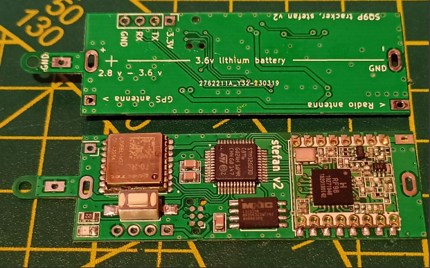
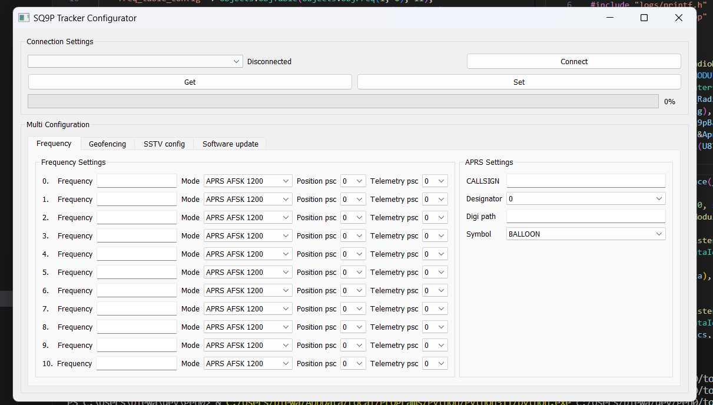

# tracker configurator
## tracker setup
  

* connect usb uart adapter to GND, TX, TX pins
* if battery isnt soldered connect power to 3.3V, be sure to not exceed 3.6V
* enter configuration mode by shortly pressing button 5 times
* after entering configuration mode led will blink 3 times in 5 s intervals

## connecting configurator
  
* select COM port of usb adapter and press connect
* press GET to read configuration from tracker